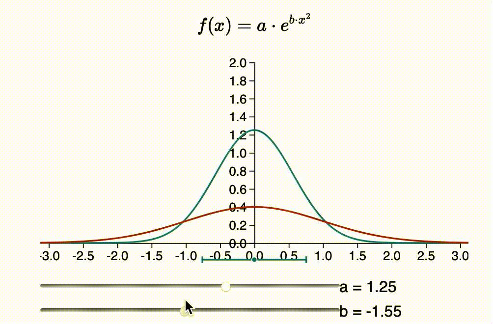

# Statistics For Mortals
A collection of websites designed to look great and explain statistics things visually. Interaction is key,
and a lot of inspiration was taken from other [explorable explanations](https://explorabl.es). The
explanations are designed to be viewed on your phone (although should work on a wide-screen device).

### Intuition behind the Standard Normal Distribution
[This](https://people.cs.uct.ac.za/~KNXBOY001/StatsForMortals/0_intro.html) website explains
the standard normal distribution (ie the 'bell curve') using *lots* of graphs, sliders, and graphs with sliders.
It is made to be *fun*, but to still explain why the formula for the normal distribution includes pi, square
roots or *e*.

### Intuition behind the Multivariate Normal Distribution
Still a work in progress, but the most recent versions are uploaded 
[here](https://people.cs.uct.ac.za/~KNXBOY001/StatsForMortals/mvn/0_intro.html)

### Future ideas
Future ideas and notes are kept in `ideas.md` and
 [here](https://people.cs.uct.ac.za/~KNXBOY001/StatsForMortals/ideas.md)

